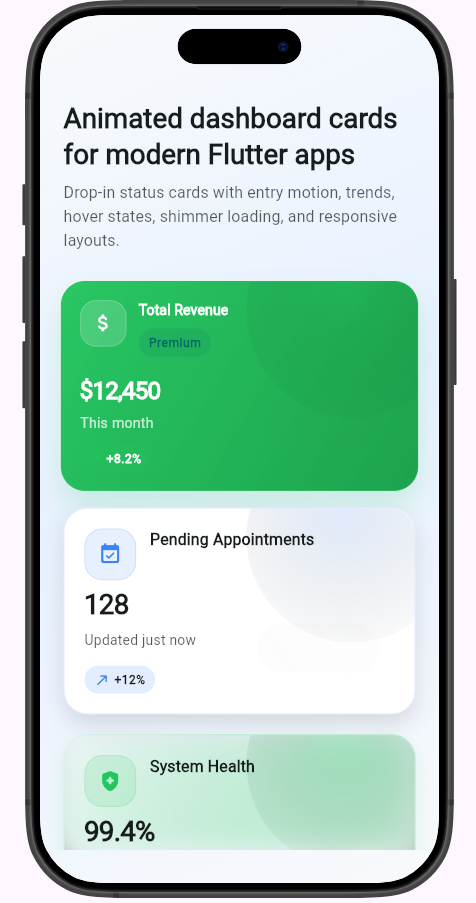
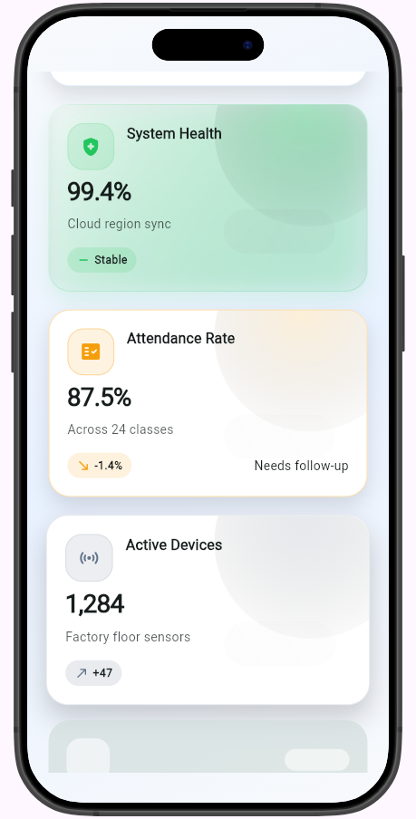
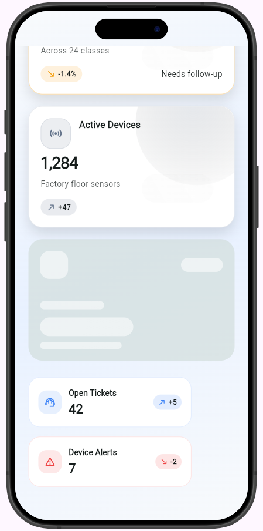

# animated_status_card

<p align="center">
  <a href="https://github.com/Azrul16/animated_status_card/stargazers">
    
  </a>
  <a href="https://github.com/Azrul16/animated_status_card/network/members">
    
  </a>
  <a href="https://github.com/Azrul16/animated_status_card/blob/main/LICENSE">
    
  </a>
  <a href="https://pub.dev/packages/animated_status_card">
    
  </a>
</p>

A polished Flutter package for building animated dashboard and status cards with trends, loading states, hover feedback, and responsive layouts.

`animated_status_card` is designed for admin panels, analytics screens, finance apps, healthcare dashboards, student portals, and IoT monitoring interfaces where small metric cards need to feel modern and alive without adding a lot of UI code.

## Support The Project

If this package helps you, please consider giving the repository a star:

- Star the repo:
  <https://github.com/Azrul16/animated_status_card>
- Fork the repo:
  <https://github.com/Azrul16/animated_status_card/fork>

Stars help the package reach more Flutter developers, and forks make it easier for others to contribute improvements.

## Why This Package

This package gives you drop-in status widgets for metrics like:

- Total Users
- Revenue
- Pending Appointments
- Attendance Rate
- Active Devices
- System Health

Instead of manually wiring entry animations, trend labels, hover effects, loading placeholders, and styling each time, you can use a small API and get a more complete dashboard card out of the box.

## Preview

<p align="center">
  
  
  
</p>

## Features

- Animated card entry with `fade`, `slideUp`, `scale`, or `none`
- Hover and press feedback for web, desktop, and mobile
- Trend indicators with up, down, and neutral states
- Value-change animation for numeric and string-based values
- Built-in shimmer loading placeholder
- Multiple visual styles:
  `simple`, `gradient`, `outlined`, `glass`, `minimal`
- Status presets:
  `success`, `warning`, `danger`, `info`, `neutral`
- Optional badge, trailing, and footer content
- Responsive wrapping layout for card collections
- Easy integration with light and dark themes

## Animation Highlights

- `fade` entry for subtle dashboard reveals
- `slideUp` entry for a more dynamic analytics feel
- `scale` entry for compact or premium card layouts
- Hover lift and press scaling for better interaction feedback
- Animated value transitions for metric changes
- Shimmer loading state for async dashboard data

## Visual Highlights

- Material icons for instant visual context
- Accent-driven status colors for success, warning, danger, and info
- Gradient and glass card styles for a more premium dashboard look
- Badge, footer, and trend chip support for denser information display

## Installation

Add the dependency to your `pubspec.yaml`:

```yaml
dependencies:
  animated_status_card: ^0.0.1
```

Then run:

```bash
flutter pub get
```

Or clone the repository locally:

```bash
git clone https://github.com/Azrul16/animated_status_card.git
cd animated_status_card
flutter pub get
```

## Import

```dart
import 'package:animated_status_card/animated_status_card.dart';
```

## Quick Start

```dart
AnimatedStatusCard(
  title: 'Pending Appointments',
  value: '128',
  subtitle: 'Updated just now',
  icon: Icons.pending_actions,
  trendValue: '+12%',
  trendDirection: TrendDirection.up,
  styleType: CardStyleType.simple,
  statusType: CardStatusType.info,
)
```

## Main Widget

```dart
AnimatedStatusCard(
  title: 'Revenue',
  value: '\$12,450',
  subtitle: 'This month',
  icon: Icons.attach_money_rounded,
  trendValue: '+8.2%',
  trendDirection: TrendDirection.up,
  styleType: CardStyleType.gradient,
  statusType: CardStatusType.success,
  animationType: EntryAnimationType.slideUp,
  animateOnValueChange: true,
  badge: const AnimatedMetricBadge(label: 'Premium'),
  onTap: () {},
)
```

## Responsive Dashboard Example

```dart
AnimatedStatusCardGrid(
  minChildWidth: 260,
  children: const [
    AnimatedStatusCard(
      title: 'Total Revenue',
      value: '\$12,450',
      subtitle: 'This month',
      icon: Icons.attach_money_rounded,
      trendValue: '+8.2%',
      trendDirection: TrendDirection.up,
      styleType: CardStyleType.gradient,
      statusType: CardStatusType.success,
    ),
    AnimatedStatusCard(
      title: 'System Health',
      value: '99.4%',
      subtitle: 'Cloud region sync',
      icon: Icons.health_and_safety_rounded,
      trendValue: 'Stable',
      trendDirection: TrendDirection.neutral,
      styleType: CardStyleType.glass,
      statusType: CardStatusType.success,
    ),
    AnimatedStatusCard(
      title: 'Loading Preview',
      value: '0',
      isLoading: true,
    ),
  ],
)
```

## Included Widgets

### `AnimatedStatusCard`

The main dashboard card with:

- title, value, subtitle, and icon
- trend chip support
- style and status presets
- loading mode
- animated value transitions
- badge, trailing widget, and footer support

### `AnimatedStatusCardGrid`

A responsive layout helper that wraps cards based on available width.

### `AnimatedStatusShimmerCard`

A standalone shimmer/skeleton card for loading states.

### `AnimatedMiniStatusCard`

A smaller compact card for denser dashboards, sidebars, and summary rows.

### `AnimatedMetricBadge`

A small pill badge for labels such as `Premium`, `Live`, `Synced`, or `Beta`.

## Core Enums

```dart
enum CardStyleType { simple, gradient, outlined, glass, minimal }
enum CardStatusType { success, warning, danger, info, neutral }
enum TrendDirection { up, down, neutral }
enum EntryAnimationType { fade, slideUp, scale, none }
```

## Common Parameters

These are the most important properties on `AnimatedStatusCard`:

```dart
AnimatedStatusCard({
  required String title,
  required String value,
  String? subtitle,
  IconData? icon,
  String? trendValue,
  TrendDirection trendDirection = TrendDirection.neutral,
  CardStyleType styleType = CardStyleType.simple,
  CardStatusType statusType = CardStatusType.info,
  EntryAnimationType animationType = EntryAnimationType.slideUp,
  Duration duration = const Duration(milliseconds: 500),
  bool isLoading = false,
  bool animateOnValueChange = true,
  VoidCallback? onTap,
  Widget? badge,
  Widget? trailing,
  Widget? footer,
  double height = 208,
  double borderRadius = 24,
  Color? accentColor,
  Color? backgroundColor,
  Color? foregroundColor,
})
```

## Styling Notes

- Use `styleType` to switch between visual presets.
- Use `statusType` to quickly apply semantic colors.
- Override `accentColor`, `backgroundColor`, or `foregroundColor` for custom branding.
- Set `animateOnValueChange: false` if you want static value rendering.
- Use `isLoading: true` to show the shimmer card without branching your UI manually.

## Use Cases

`animated_status_card` works well for:

- admin dashboards
- analytics screens
- finance and SaaS products
- hospital or clinic management systems
- school and attendance apps
- IoT control panels
- operations and monitoring tools

## Local Showcase

This repository includes a runnable showcase app:

- Bootstrap entry:
  [lib/main.dart](/d:/Github/animated_status_card/lib/main.dart)
- Showcase UI:
  [lib/showcase_app.dart](/d:/Github/animated_status_card/lib/showcase_app.dart)

The current app bootstrap is wrapped with `device_preview` so you can preview the dashboard across device sizes while developing locally.

To run the local showcase:

```bash
flutter run
```

To create your own copy for experimentation:

```bash
git clone https://github.com/Azrul16/animated_status_card.git
```

Or use the GitHub fork button:

- Fork here:
  <https://github.com/Azrul16/animated_status_card/fork>

## Package Structure

```text
lib/
|-- animated_status_card.dart
|-- main.dart
|-- showcase_app.dart
`-- src/
    |-- enums/
    |-- models/
    |-- painters/
    |-- utils/
    `-- widgets/
```

## Roadmap

Planned improvements after `0.0.1`:

- richer theme presets
- more badge and footer variants
- chart-ready card variants
- screenshots and GIFs for pub.dev
- more advanced animated counters
- more motion presets and richer icon storytelling in examples

## License

Add your preferred license here before publishing to pub.dev.
